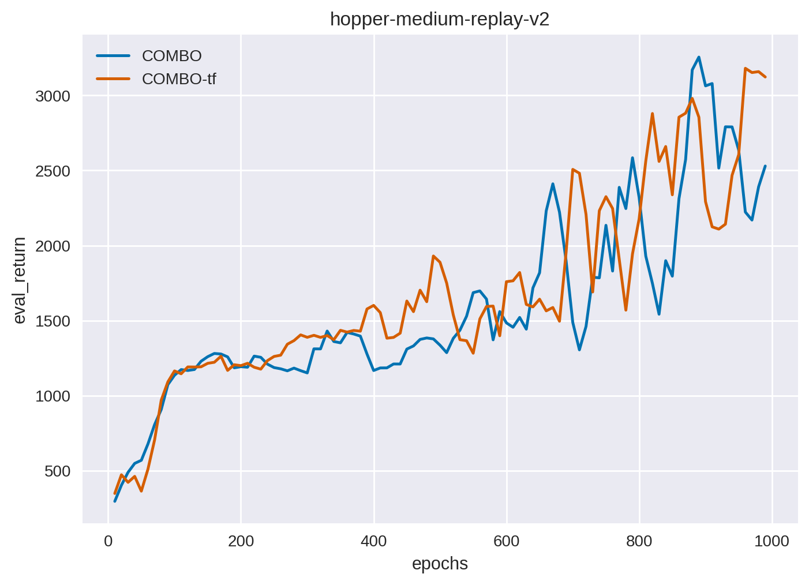
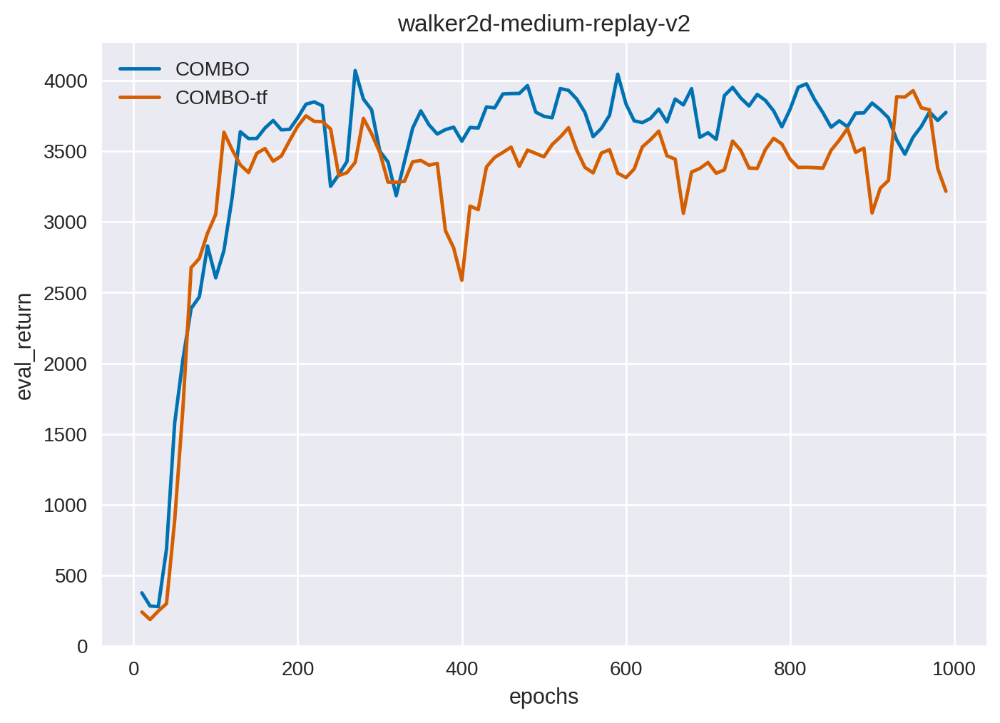
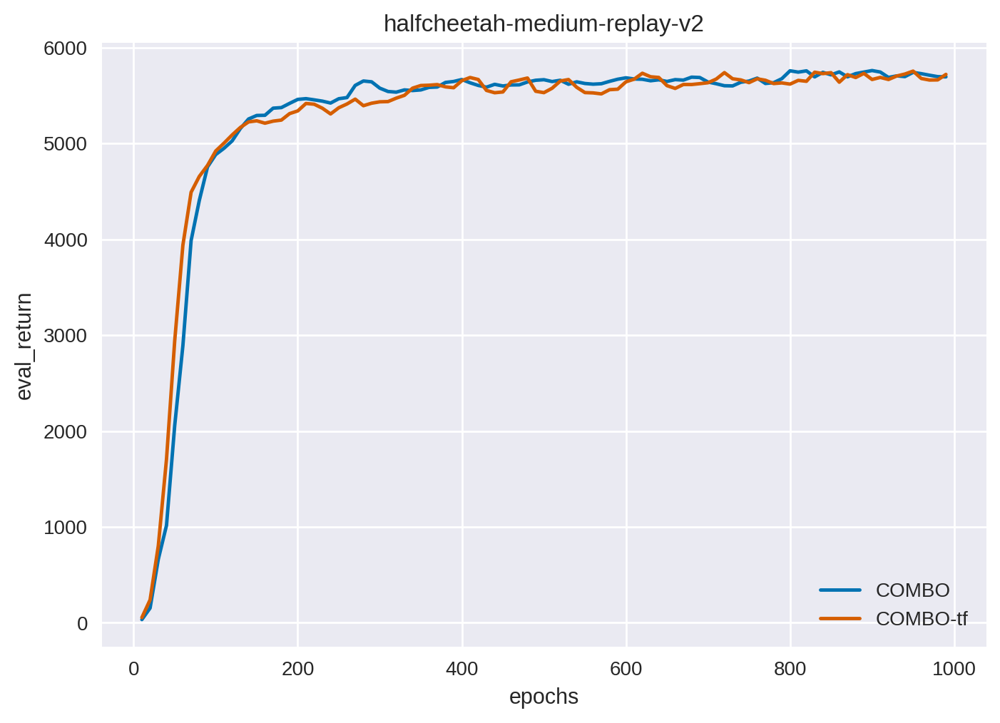

# Overview
We provide a torch implementation of offline model-based reinforcement learning algorithm COMBO described in the following paper [COMBO: Conservative Offline Model-based Policy Optimization](https://arxiv.org/pdf/2005.13239.pdf)

The implementation of ensemble dynamics model will have an important impact on the performance of model-based RL algorithm. Both tensorflow dynamic model and pytorch dynamic model are tested. For tensorflow model, we don't find offcial code for COMBO, so we reuse the official version in [MOPO: Model-based Offline Policy Optimization](https://arxiv.org/pdf/2005.13239.pdf), which is proposed by the same research team. But in our implementation, there are no significant differences between two versions of dynamic model.

# Main Dependencies
- gym 0.22.0
- torch 1.13.0
- d4rl 1.1
- mujoco 2.3.0 

If you hope to run a tensorflow dynamic model, it's required : **tensorflow 2.x**

# Usage

## train

```
# for hopper-medium-replay-v2 task by torch dynamic model
python main.py --task hopper-medium-replay-v2

# for hopper-medium-replay-v2 task by tensorflow dynamic model
python ./agent_tf/main.py --task hopper-medium-replay-v2

```
You can adjust hyberparameters in **config.py**
## plot

```
python plot.py --task hopper-medium-replay-v2

```

# Results
All experiments were run by random seed 0.
### hopper-medium-replay-v2



### walker2d-medium-replay-v2



### halfcheetah-medium-replay-v2



# Reference

- Official tensorflow implementation for mopo: [https://github.com/tianheyu927/mopo](https://github.com/tianheyu927/mopo)
